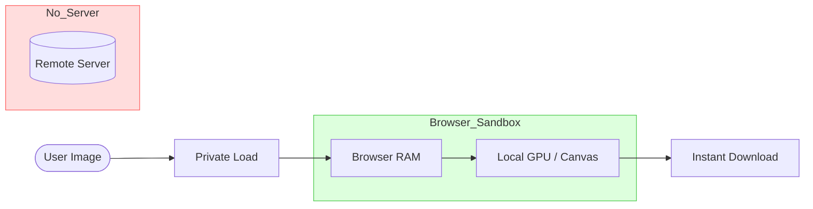

# 🖼️ Fast Image Rotator

**Fast Image Rotator** is a professional-grade, privacy-centric single-purpose web app designed for high-speed image transformations. It allows users to rotate, flip, and fine-tune images with zero-latency previews, all while ensuring that 100% of the image processing remains local to the browser—no data ever touches a server.

---

<p align="center">
  
  
  
</p>

<p align="center">
  
  
  
  
</p>

---

### 🚀 Key Highlights:
- **⚡ Lightning Fast**: Optimized canvas-based rendering for instant edits and high-quality exports.
- **🔒 Privacy First**: All processing stays on your device. Zero server uploads, 100% security.
- **🎯 Precision Tools**: 90° snap rotations, Horizontal/Vertical flipping, and a 360° fine-tuned slider.
- **🌗 Dual-Theme Engine**: Sleek "Midnight Slate" and "Clean Light" modes.
- **✨ Next-Gen Stack**: Built with React 19 and Vite 8 for ultimate performance.

---

## 🛡️ Why Fast Image Rotator?

| Feature | Fast Image Rotator | Typical Online Editors |
| :--- | :---: | :---: |
| **Privacy** | ✅ 100% Local | ❌ Requires Upload |
| **Speed** | ✅ Instant (GPU) | ❌ Network Dependent |
| **Offline** | ✅ Works Offline | ❌ Requires Internet |
| **Cost** | ✅ Free Forever | ❌ Often Ad-supported |
| **Security** | ✅ No Data Logs | ❌ Server Side History |

---

## 🛡️ The Privacy Guarantee

Typical online editors require you to upload your files to their servers "to process them." **Fast Image Rotator** is different. 

### 📐 How it works (Local-Only Data Flow):



1. **Local-Only**: Your image is loaded into your browser's RAM as a Data URL.
2. **GPU Accelerated**: Transformations are performed by your local GPU using HTML5 Canvas.
3. **No Network**: You can even use this app offline once the page is loaded.
4. **Safe**: Your data never leaves your computer. Period.

---

## 📖 Usage Tips

- **🖱️ Drag & Drop**: You don't need to click "Browse". Just drag any image from your folder directly onto the app.
- **🔄 Real-time Compare**: Click and hold the **"Original Preview"** button in the bottom right to instantly compare your edits with the raw photo.
- **📏 Metadata HUD**: Keep an eye on the bottom pill to see real-time dimension changes as you rotate.
- **💾 Save locally**: Once you're done, the high-quality edited version is baked on your device and saved instantly.

---

## ✨ Features In-Depth

- **🛡️ 100% Client-Side**: No telemetry, no tracking, no uploads.
- **🔄 Precision Transforms**:
  - **Fine rotation slider**: Adjust the angle from 0° to 360° with 1-degree precision.
  - **Quick Rotate**: Instant -90° and +90° buttons for standard adjustments.
  - **Mirroring**: One-click Horizontal and Vertical flipping.
- **📊 Live Metadata HUD**: Instant readout of image dimensions and auto-calculated orientation (Portrait/Landscape).
- **🎨 Visual Excellence**:
  - **Shimmer Overlays**: Real-time feedback during image generation.
  - **Celebration Confetti**: A delightful spark on every successful download!
- **⚡ Pro-Link Performance**: Instant preview using CSS transforms, followed by high-quality Canvas baking on export.

---

## 🏗️ Technical Architecture

**Fast Image Rotator** uses a high-performance, single-page architecture:

- **State Management**: React 19 functional updates for bug-free history and transformations.
- **Image Pipeline**: 
  - `FileReader` for safe, local-only data ingestion.
  - `HTML5 Canvas API` for GPU-accelerated pixel transformations.
  - `toDataURL` for zero-server image generation.
- **CSS Engine**: A custom variable-driven design system optimized for dark mode and mobile responsiveness.

---

## 🗺️ Roadmap

- [ ] **Batch Processing**: Rotate multiple images at once.
- [ ] **Custom Resizing**: Change dimensions while maintaining aspect ratio.
- [ ] **Format Conversion**: PNG to WebP/JPG/etc.
- [ ] **PWA Support**: Installable desktop/mobile app for offline use.
- [ ] **Keyboard Shortcuts**: `R` for rotate, `F` for flip, `S` for save.

---

## 🚀 Getting Started

### Installation

```bash
# Clone the project
git clone https://github.com/rifatcholakov/Fast-Image-Rotator.git

# Enter directory
cd Fast-Image-Rotator

# Install & Run
npm install && npm run dev
```

The app will now be available at `http://localhost:5173/`.

---

## 🤝 Contributing

Contributions are what make the open-source community such an amazing place to learn, inspire, and create. Any contributions you make are **greatly appreciated**.

1. Fork the Project
2. Create your Feature Branch (`git checkout -b feature/AmazingFeature`)
3. Commit your Changes (`git commit -m 'Add some AmazingFeature'`)
4. Push to the Branch (`git push origin feature/AmazingFeature`)
5. Open a Pull Request

---

## 📜 License

Distributed under the **MIT License**. See `LICENSE` for more information.

---

## 👤 Author

**Rifat Cholakov**
- GitHub: [@rifatcholakov](https://github.com/rifatcholakov/Fast-Image-Rotator)

---

> [!TIP]
> Enjoying the tool? Give it a ⭐ on GitHub to help others find this private alternative!
